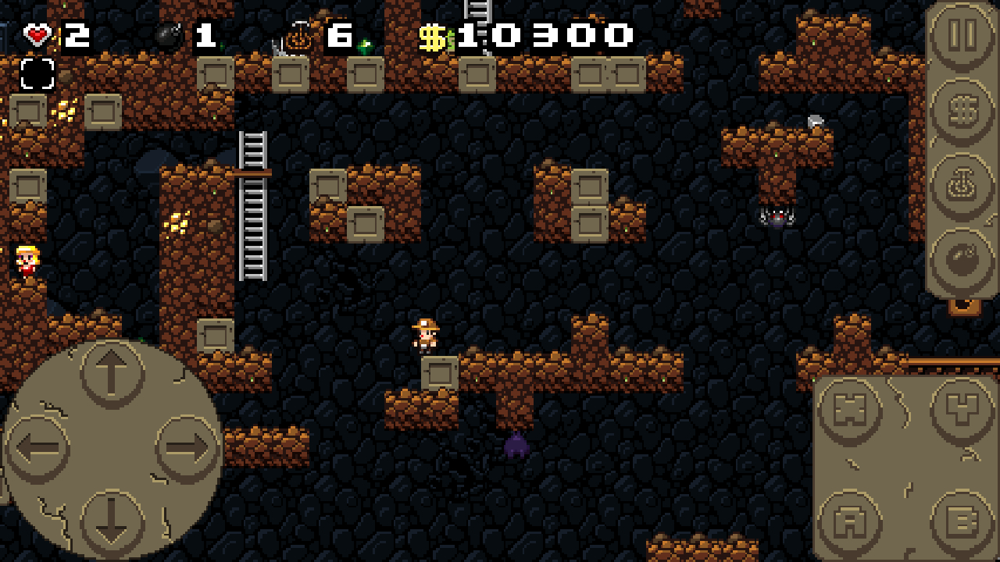

# Spelunky Classic HD HTML5 (SCI199 Version)

HTML5 version of [Spelunky Classic HD](https://github.com/yancharkin/SpelunkyClassicHD).

**This version is currently being modified by Cris Escandor**

This version has a bit more bugs but also it has some nice features:
- you can play it in [your browser](https://yancharkin.github.io/SpelunkyClassicHDhtml5/)
- [builds for macOS, 64 bits builds for Linux and Windows, ARM builds for Linux (Electron)](https://github.com/yancharkin/SpelunkyClassicHDhtml5/releases)
- touch input on any device that supports it (not only android)

## Ideas for changes:

### 1. Story!
Storyline: The treasure hunter is an R programmer exploring caes to debug a dataset and find statistical insights

Progression in the game mirrors solving a dataset's "mystery" (e.g., identifying missind data, uncovering treds)

### 2. Integrating StatBiscuit Mini-Games
* Replace "locked doors" and "treasure chests" with mini-game challenges from the statbiscuit games

### 3. Integrating Other mini-games
* e.g., hypothesis testing, regression analysis, or visualisation based to unlock rewards or progress
* Should algin with key concepts in R (e.g., generating and interpreting plots, understanding p-values)
* **p-value game would be cool to integrate here**

<u> Initial ideas on how to do this: </u>
* Embed StatBiscuit games as pop-ups ?
* Customise UI to seamlessly transition between Spelunky gameplay and the puzzles.

### 3.5 Visualisation-Based Puzzles
* Incorporate puzzles that require players to interpret visualisations (e.g., histograms, box plots, scatterplots) to progress
    * e.g., *"A treasure room is locked behind a puzzle requiring players to identify the outlier in a box plot or solve a regression equation to unlock the door"*

### 4. R-Driven Enemies and Hazards
* Replace default enemies and hazards with R-focused mechanics... e.g.,
    * An "ANOVA monster" that throws variables at players, defeated by choosing the right statistical test. 
    * A "linear regression snake" whose movement is based on the slope and intercept of an equation

<u> Initial ideas on how to do this </u>
* Use JSON or CSV files generated in R to define enemy behaviour dynamically 

### 5. Statistical Power-ups and Tools
* Replace traditional power-ups with statistical tools:
    * "P-value Detector": Helps identify fake treasures (e.g., false positives)
    * "Data Cleaner": Rremoves incorrect datasets (Traps) from the level
    * "Confidence Interal Boots": Allows safe traversal over hazardous ground (based on margin of error)

<u> How to do this: </u>
* Modify item pickup scripts to implement these mechanics
* Add corresponding UI elements to represent the new tools

### 6. End of game metrics

* Scoring system
* Post-game metrics
    * time taken per level
    success rates for puzzles

